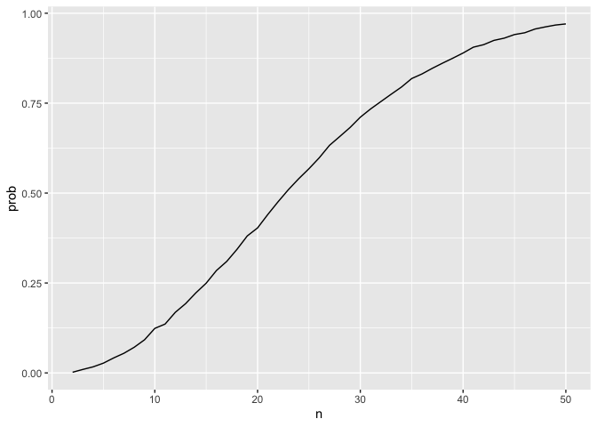
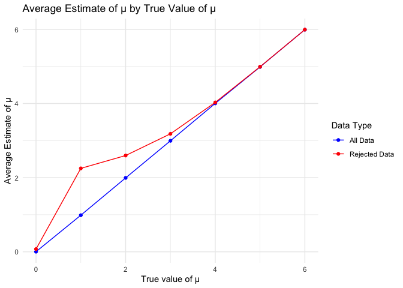
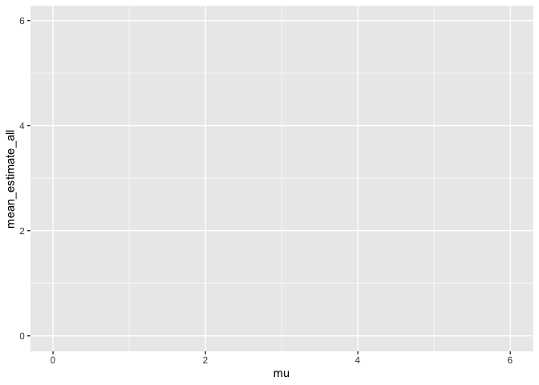

P8105 HW5
================
Kehan Su
2024-11-15

## Problem 1

``` r
bday_sim = function(n) {
  
  bdays = sample(1:365, size = n, replace = TRUE)
  
  duplicate = length(unique(bdays)) < n
  
  return(duplicate)
}
```

``` r
sim_res = 
  expand_grid(
    n = c(2:50),
    iter = 1:10000
  ) |>
  mutate(res = map_lgl(n,bday_sim)) |>
  group_by(n) |>
  summarize(prob = mean(res))

sim_res |>
  ggplot(aes(x = n, y = prob)) +
  geom_line() 
```

<!-- -->

## Problem 2

``` r
# Function to simulate the experiment
exp_sim = function(mu) {
  data = rnorm(30, mean = mu, sd = 5)
  tidy_result = 
    broom::tidy(t.test(data, mu = 0)) |>
    select(estimate, p.value)
  return(tidy_result)
}

# Simulate experiments for different mu values
exp_df = 
  expand.grid(
    mu = c(0:6),
    iter = 1:5000
  ) |>
  mutate(result = map(mu, exp_sim)) |>
  unnest(result)
```

``` r
# Calculate power and mean estimates
exp_df_summary = exp_df |>
  group_by(mu) |>
  summarise(
    power = sum(p.value < 0.05),
    mean_estimate_all = mean(estimate),
    mean_estimate_reject = mean(estimate[p.value < 0.05])
  )

# Convert power to a proportion
exp_df_summary$power <- exp_df_summary$power / 5000

# Plot 1: Power vs Effect Size
ggplot(exp_df_summary, aes(x = mu, y = power)) +
  geom_line() +
  geom_point() +
  labs(x = "True value of μ", y = "Power", title = "Power of the Test by Effect Size") +
  geom_hline(yintercept = 0.05, linetype = "dashed")
```

<!-- -->

``` r
# Plot 2: Average Estimate of μ vs True Value of μ
ggplot(exp_df_summary, aes(x = mu, y = mean_estimate_all)) +
  geom_line() +
  geom_point() +
  labs(x = "True value of μ", y = "Average Estimate of μ", title = "Average Estimate of μ by True Value of μ") +
  geom_line(aes(y = mean_estimate_reject)) +
  geom_point(aes(y = mean_estimate_reject))
```

<!-- -->

``` r
# Show the plots
print(ggplot(exp_df_summary, aes(x = mu, y = power)))
```

<!-- -->

``` r
print(ggplot(exp_df_summary, aes(x = mu, y = mean_estimate_all)))
```

<!-- -->
