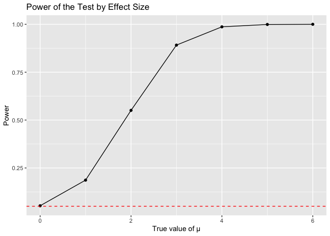

P8105 HW5
================
Kehan Su
2024-11-15

## Problem 1

``` r
bday_sim = function(n) {
  
  bdays = sample(1:365, size = n, replace = TRUE)
  
  duplicate = length(unique(bdays)) < n
  
  return(duplicate)
}
```

``` r
sim_res = 
  expand_grid(
    n = c(2:50),
    iter = 1:10000
  ) |>
  mutate(res = map_lgl(n,bday_sim)) |>
  group_by(n) |>
  summarize(prob = mean(res))

sim_res |>
  ggplot(aes(x = n, y = prob)) +
  geom_line() 
```

<!-- -->

## Problem 2

``` r
# Function to simulate the experiment
exp_sim = function(mu) {
  data = rnorm(30, mean = mu, sd = 5)
  tidy_result = 
    broom::tidy(t.test(data, mu = 0)) |>
    select(estimate, p.value)
  return(tidy_result)
}

# Simulate experiments for different mu values
exp_df = 
  expand.grid(
    mu = c(0:6),
    iter = 1:5000
  ) |>
  mutate(result = map(mu, exp_sim)) |>
  unnest(result)
```

``` r
# Calculate power and mean estimates
exp_df_summary = exp_df |>
  group_by(mu) |>
  summarise(
    power = sum(p.value < 0.05),
    mean_estimate_all = mean(estimate),
    mean_estimate_reject = mean(estimate[p.value < 0.05])
  )

# Convert power to a proportion
exp_df_summary$power <- exp_df_summary$power / 5000

# Plot 1: Power vs Effect Size
ggplot(exp_df_summary, aes(x = mu, y = power)) +
  geom_line() +
  geom_point() +
  labs(x = "True value of μ", y = "Power", title = "Power of the Test by Effect Size") +
  geom_hline(yintercept = 0.05, linetype = "dashed", color = "red")
```

<!-- --> The
plot shows a positive association between effect size (true value of mu)
and the power of the test.

``` r
# Plot 2: Average Estimate of μ vs True Value of μ
ggplot(exp_df_summary, aes(x = mu)) +
  geom_line(aes(y = mean_estimate_all, color = "All Data")) +
  geom_point(aes(y = mean_estimate_all, color = "All Data")) +
  geom_line(aes(y = mean_estimate_reject, color = "Rejected Data")) +
  geom_point(aes(y = mean_estimate_reject, color = "Rejected Data")) +
  scale_color_manual(name = "Data Type", values = c("All Data" = "blue", "Rejected Data" = "red")) +
  labs(x = "True value of μ", y = "Average Estimate of μ", title = "Average Estimate of μ by True Value of μ") +
  theme_minimal() +
  theme(legend.position = "right")
```

<!-- --> The
sample average of 𝜇̂ across tests for which the null is rejecte dis not
approximately equal to the true value of 𝜇. It is because of selection
bias. When filtering only for tests where the null hypothesis was
rejected, we tend to get samples where random variation pushed the
sample mean further from zero, which increases the likelihood of
rejecting the null.

## Problem 3

``` r
url = "https://raw.githubusercontent.com/washingtonpost/data-homicides/master/homicide-data.csv"
homicide_data = read_csv(url)
```

    ## Rows: 52179 Columns: 12
    ## ── Column specification ────────────────────────────────────────────────────────
    ## Delimiter: ","
    ## chr (9): uid, victim_last, victim_first, victim_race, victim_age, victim_sex...
    ## dbl (3): reported_date, lat, lon
    ## 
    ## ℹ Use `spec()` to retrieve the full column specification for this data.
    ## ℹ Specify the column types or set `show_col_types = FALSE` to quiet this message.

``` r
# Summarize the data
summarized_data = homicide_data |>
    mutate(city_state = paste(city, state, sep = ","),
    unsolved = ifelse(disposition %in% c("Closed without arrest", "Open/No arrest"), 1, 0)
    ) |>
  filter(!(city_state == "Tulsa,AL")) |>
  group_by(city_state) |>
  summarize(
    total_homicides = n(),
    unsolved_homicides = sum(unsolved)
  )
```

``` r
# Test for Baltimore
baltimore_data =
  summarized_data |>
  filter(city_state == "Baltimore,MD")

baltimore_prop_test = baltimore_data |>
  with(prop.test(unsolved_homicides, total_homicides))

baltimore_summary = 
  broom::tidy(baltimore_prop_test) |>
  select(estimate, conf.low, conf.high)

baltimore_summary
```

    ## # A tibble: 1 × 3
    ##   estimate conf.low conf.high
    ##      <dbl>    <dbl>     <dbl>
    ## 1    0.646    0.628     0.663

``` r
# Test for all cities
city_results = summarized_data |>
  mutate(
    test_result = purrr::map2(unsolved_homicides, total_homicides, ~ prop.test(.x, .y) |> broom::tidy())
  ) |>
  unnest(test_result) |>
  select(city_state, estimate, conf.low, conf.high)
city_results
```

    ## # A tibble: 50 × 4
    ##    city_state     estimate conf.low conf.high
    ##    <chr>             <dbl>    <dbl>     <dbl>
    ##  1 Albuquerque,NM    0.386    0.337     0.438
    ##  2 Atlanta,GA        0.383    0.353     0.415
    ##  3 Baltimore,MD      0.646    0.628     0.663
    ##  4 Baton Rouge,LA    0.462    0.414     0.511
    ##  5 Birmingham,AL     0.434    0.399     0.469
    ##  6 Boston,MA         0.505    0.465     0.545
    ##  7 Buffalo,NY        0.612    0.569     0.654
    ##  8 Charlotte,NC      0.300    0.266     0.336
    ##  9 Chicago,IL        0.736    0.724     0.747
    ## 10 Cincinnati,OH     0.445    0.408     0.483
    ## # ℹ 40 more rows

``` r
city_results |>
  mutate(city_state = fct_reorder(city_state, estimate)) |>
  ggplot(aes(x = city_state, y = estimate)) +
  geom_point() +
  geom_errorbar(aes(ymin = conf.low, ymax = conf.high), width = 0.2) +
  coord_flip() +
  labs(
    title = "Proportion of Unsolved Homicides by City",
    x = "City",
    y = "Proportion of Unsolved Homicides"
  )
```

<!-- -->
